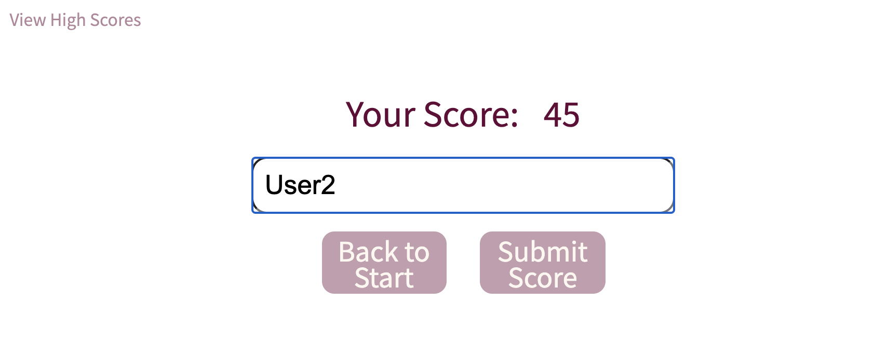

# ThatCodeQuiz
Author Tomasz Siemion
Project: Code Quiz
LINK: https://rotosti.github.io/ThatCodeQuiz/

This project was to make a simple code quiz web application that will update dynamically as it progresses through the quiz versus reloading static pages.  

My web app is devided into several "cards" which will show based on what is currently happening.  There are event listeners on buttons that change the visible state of each card.  The app also stores previous high scores and will check local storage if there are any to retrieve.

On the welcome card, you can start the game or view the high scores. The question card will ask a question, give you answers, show you whether you answered a question wrong or right, and show you the time remaining and your current score in the upper right corner of your screen.  The form card will show your high score and give you the opportunity to save your name and your score on the leader board.  The leader board will allow you to return back to the welcome card or clear the leader board.

The welcome card is updated dynamically.  It has some modularity in the javascript where there are 3 variables which store how many questions to be asked, the amount of time given to answer the questions, and the time penalty the user will receive when a question is answered incorrectly.  If the user decides to start the quiz, they are able to click on a button to start the game or view the high scores. 

If the user decides to start the game, the button click does several things to set up the game.  It will have the question bank randomly pick out the specified amount of questions and verify there are no duplicate questions.  It will show the timer and score in the upper right corner of the browser window. It will add event listeners on the answer choices, update to the first question, and start the timer.  The question card will wait for a user input on an answer.  If the user clicks an answer, the event handler there will verify if the user chose the right answer, notify the user with some colored text, and move on to the next question.  Once time runs out or the correct amount of questions have been asked, the game will end.

The form card will ask if the user wants to enter their name and score onto the leader board.  If the user decides they do not want to, they can return back to the welcome card or submit their scores.

If the user decides to submit their score.  The score will be updated on the leaderboard.  The highest scores are sorted and will appear at the top of the list. The scores will be stored to local storage to have some persistence.  If the user decides to clear the scores, they can be done on the leaderboard card.  The clear will clear the information in the app, the leader board visible to the user, and in local storage.

Welcome Card

Question Card

Form Card

High Scores Card

